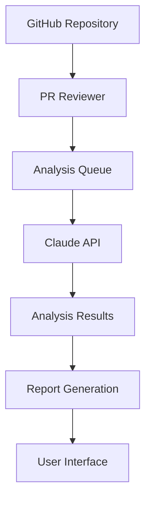

# Architecture Overview

## System Architecture

PR Reviewer is built using a modern, scalable architecture designed to provide efficient and reliable code review assistance.

### Tech Stack

#### Frontend
- **Framework**: Next.js with TypeScript
- **UI Components**: shadcn/ui + Radix UI
- **Styling**: Tailwind CSS
- **State Management**: [To be decided: Zustand/Jotai]
- **Package Manager**: pnpm

#### Backend
- **Runtime**: Node.js
- **API**: [To be implemented]
- **Database**: [To be decided]
- **Queue System**: [To be implemented]

#### AI Integration
- **Model**: Claude API
- **Analysis Pipeline**: Custom implementation

### System Components

## Key Components

### 1. GitHub Integration
- Webhook receiver for PR events
- GitHub API integration for PR data
- Authentication and authorization

### 2. Analysis Pipeline
- Queue management system
- Rate limiting and cost optimization
- Parallel processing capabilities
- Error handling and recovery

### 3. User Interface
- Responsive design
- Custom loading animations
- Interactive report viewing
- User preferences management

### 4. Data Flow
- PR metadata collection
- Code analysis processing
- Report generation
- User interaction handling

## Security Considerations

### Authentication
- GitHub OAuth integration
- JWT token management
- Session handling

### Data Protection
- Secure API communication
- Data encryption
- Rate limiting
- Access control

## Performance Optimization

### Caching Strategy
- Response caching
- Asset optimization
- CDN integration

### Resource Management
- Queue prioritization
- Cost optimization
- Rate limit management

## Monitoring and Logging

### System Metrics
- Performance monitoring
- Error tracking
- Usage analytics
- Cost tracking

## Future Considerations

### Scalability
- Microservices architecture
- Container orchestration
- Load balancing
- Database sharding

### Feature Extensions
- Additional AI models
- Enhanced analysis capabilities
- Team collaboration features
- Custom rule engines